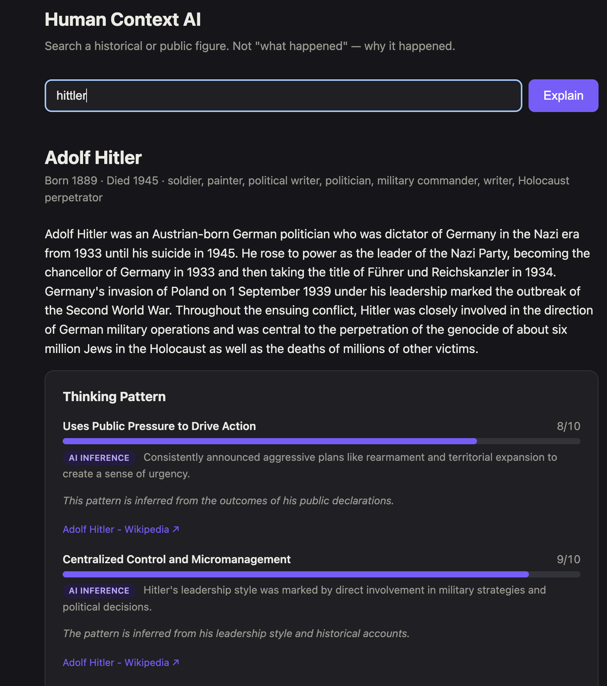
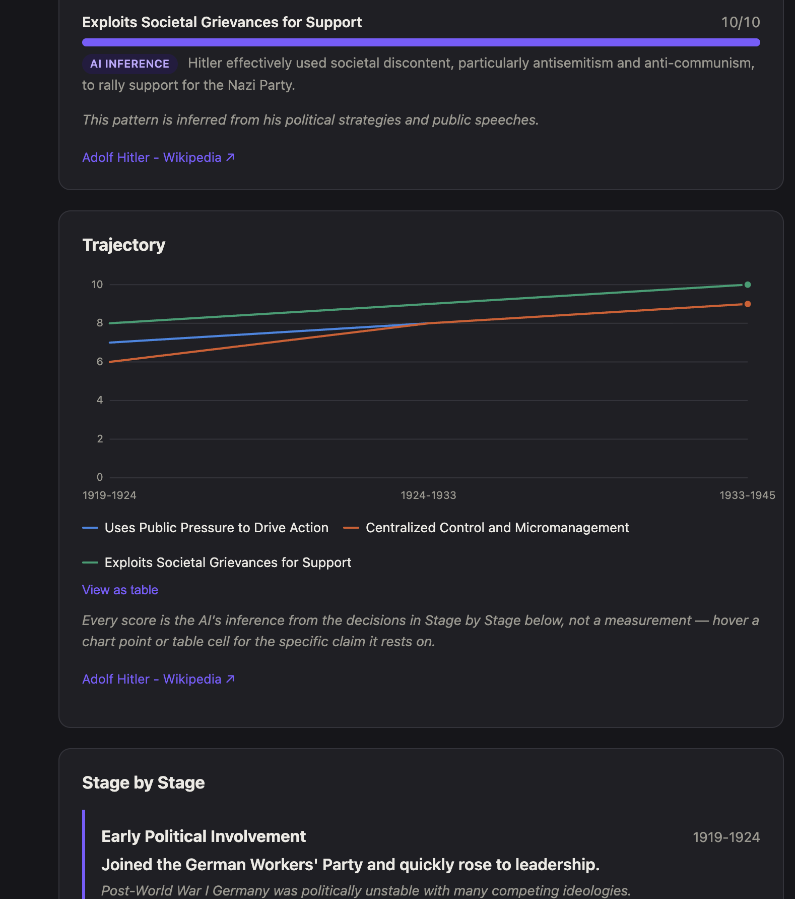
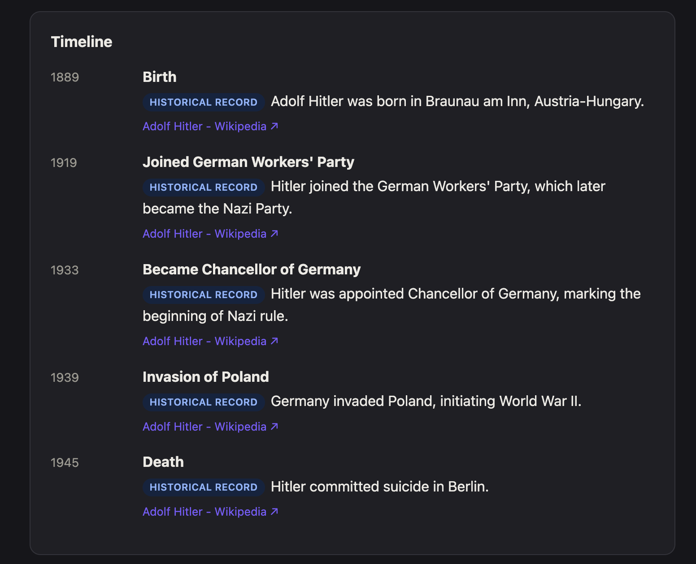

# Human Context AI

An AI system that explains not just *who* someone was, but *why* they became
who they became — starting with public historical figures to prove the
reasoning works, built toward a much more personal goal: preserving a real
family's memory for descendants who never got to meet them.

## What's in this repo

- **[`handbook/`](handbook/)** — the founder & engineering handbook: vision,
  philosophy, and the actual problem this project answers to. Start with
  [`handbook/founding-problem.md`](handbook/founding-problem.md) if you want
  the real motivation, not the pitch.
- **[`mvp/`](mvp/)** — the working code. See [`mvp/README.md`](mvp/README.md)
  for what it does and how to run it.

## Status

**Phase 1 MVP is live and working.** Search any public historical figure and
get an evidence-linked breakdown of their timeline, environment, and
relationships — plus the actual point of the system: their real thinking
patterns. Every decision the person made is broken into *how* they decided
(decision-making style) and *how* they carried it out (execution style),
synthesized into named behavioral patterns, scored, and plotted on an
interactive trajectory graph showing how each pattern strengthened or faded
across their life.

Every claim — down to every individual chart data point — is tagged with an
Evidence Hierarchy level (Direct / Historical Record / Contemporary Account /
AI Inference) and links back to its source. No unsourced number is presented
as fact anywhere in the UI.

Validated across several rounds of tuning against multiple figures (Nikola
Tesla, Elon Musk, Adolf Hitler): plain-language output aimed at a global
audience, decision-level analysis instead of generic trait labels, and full
evidence traceability on every generated claim.

### Screenshots

Searched "Adolf Hitler" end to end — real output, not a mockup:

**Thinking Pattern** — decisions scored 1-10, every claim tagged with an
evidence level and sourced back to Wikipedia:

**Trajectory** — how each pattern strengthened or faded across life stages,
with the same evidence trail behind every point on the chart:

**Timeline** — the underlying facts the analysis is built on:

## Phase 2: Family Ancestor Tool — also live

Phase 1 existed to validate the reasoning engine somewhere safe — public
figures, abundant documentation, no consent issues. The actual motivation
(see [`handbook/founding-problem.md`](handbook/founding-problem.md)) is
preserving one real family's memory for its own descendants, not historical
trivia. That's built now: the same engine, private per account, with
**strict per-family data isolation as a hard boundary** — every family
query is filtered by ownership at the database layer, and a family that
isn't yours 404s rather than confirming it exists. Verified directly with
two separate accounts, not assumed.

Input is typed family notes instead of Wikipedia, and the evidence labels
change to match: **"Family account"** for what was actually written vs.
**"General historical context, not specific to this family"** for anything
the AI added from general knowledge — the engine is instructed to keep a
profile short and honest on thin notes rather than invent detail to fill it
out. See [`mvp/README.md`](mvp/README.md) for the full writeup and
screenshots.

## Tech stack

FastAPI + Python backend, OpenAI for reasoning, Wikipedia/Wikidata for public
source material, SQLite for caching, a dependency-free HTML/JS/SVG frontend.
No Neo4j/Qdrant/Kubernetes yet — those belong to the long-term technical
roadmap, not this stage.

## License

MIT — see [LICENSE](LICENSE).
