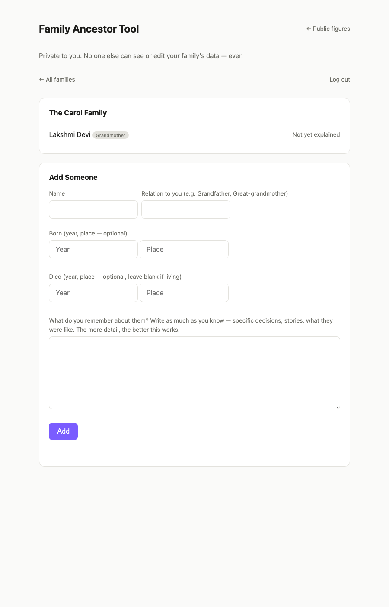
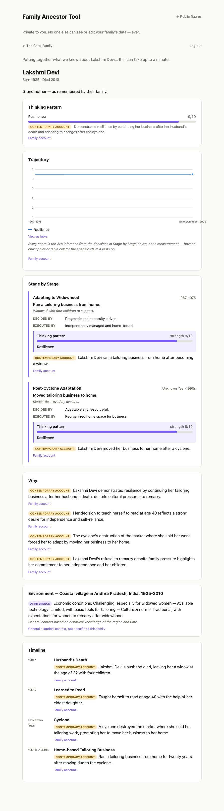

# Human Context AI — MVP

Phase 1 of the roadmap: search a historical or public figure and get an
evidence-linked explanation of *why* their life unfolded the way it did, and
*how they actually think and act* — not just a chronology. No accounts, no
private data; everything here runs on public sources (Wikipedia + Wikidata).

## What it does

1. You search a name.
2. The backend pulls facts from Wikipedia (article text) and Wikidata
   (structured facts: birth/death, occupation, relations, education).
3. An LLM turns that into:
   - **Timeline** — key life events
   - **Environment** — the political, economic, technological, and cultural
     backdrop of the person's time and place
   - **Relationships** — causal connections to other people (mentored by,
     competed with, worked at, ...)
   - **Thinking Pattern** — the actual point of the system. Specific
     decisions the person made, each split into *how* it was decided
     (decision-making style: solo or consulted, first-principles or
     precedent, reversible or not) and *how* it was carried out (execution
     style: personally involved or delegated, response to the first real
     obstacle). These are synthesized into named behavioral patterns —
     never generic trait words — and scored 1-10.
   - **Trajectory** — an interactive line chart showing how strongly each
     pattern showed up at each life stage, rising or falling over time, not
     a single static score.
   - **Why** — the broader causal narrative tying environment,
     relationships, and timing together.
4. Every single claim — from a birth date to an individual trajectory-chart
   data point — carries an Evidence Hierarchy level (Direct / Historical
   Record / Contemporary Account / AI Inference) and a source link, per the
   handbook's Chapter 6 principle: distinguish facts from inference, always,
   and never present a number with no way to check it.
5. Results are cached in SQLite so repeat searches don't re-hit the LLM.

## Status

Working end-to-end. Tested against multiple figures (Nikola Tesla, Elon
Musk, Adolf Hitler) across several rounds of prompt tuning:
- Wikipedia/Wikidata fact-gathering, with retry-on-rate-limit
- Thinking-pattern analysis in plain language for a global audience — tuned
  specifically to avoid business jargon and generic trait labels ("visionary
  leadership") in favor of specific, falsifiable mechanisms
- Trajectory chart: SVG line chart, categorical palette validated for
  colorblind-safety, hover tooltip with full evidence per point, and a
  table-view fallback for accessibility
- Every generated number is traceable to a specific claim, evidence level,
  and source — checked directly against the app, not assumed

## Running it

```bash
cd mvp/backend
python3 -m venv .venv
source .venv/bin/activate
pip install -r requirements.txt

cp .env.example .env
# edit .env and set OPENAI_API_KEY — without it, fact-gathering still
# works but the thinking-pattern/environment/narrative synthesis will 503.

uvicorn app.main:app --reload --port 8000
```

Then open http://localhost:8000 — the frontend is served by the same
FastAPI app.

## What's deliberately not here yet

No Neo4j, no Qdrant, no Kubernetes, no Next.js — those are in the full
technical roadmap (handbook Volume 3, not yet written) but would be
premature for proving the core loop works. This is one FastAPI service,
SQLite for caching, and a single static HTML page. Upgrade pieces only when
this MVP's limits actually show up in practice.

---

# Family Ancestor Tool (Phase 2 — the actual motivation)

Phase 1 validated the reasoning engine somewhere safe: public figures,
abundant documentation, no consent issues. The actual motivation for this
project (see `../handbook/founding-problem.md`) is family memory —
preserving a real person's story for descendants who never met them. This
is that: the same engine, rebuilt around a private, per-family, user-input
model instead of a public search box.

## What's different from Phase 1

- **Accounts + strict per-family data isolation.** Every family belongs to
  exactly one user. Every query — list families, list ancestors, view a
  profile — is filtered by ownership at the database layer, and a family
  that isn't yours returns 404, not 403: the app won't even confirm another
  user's family exists. Verified directly: a second account gets an empty
  family list and a 404 on the first account's family id, not an error that
  leaks its existence.
- **Notes instead of Wikipedia.** There's no public page to scrape, so a
  family member types in whatever they remember — name, relation,
  approximate dates/places, and free-text notes. The engine never invents
  beyond what's written plus general, well-known historical context for the
  stated time and place — and says so via a third Evidence Hierarchy
  source label: **"Family account"** for what was actually written, vs.
  **"General historical context, not specific to this family"** for
  everything the AI added from general knowledge. Getting this wrong isn't
  a quality bug here — see the handbook's founding problem — so the engine
  is instructed to return a short, honest, sparse profile rather than pad
  out thin notes with plausible invention.
- **Same output shape.** Timeline, Environment, Thinking Pattern, Trajectory,
  Stage by Stage, Why — identical structure and rendering to Phase 1, reused
  via a shared `shared.js`/`shared.css` rather than duplicated.

## Screenshots

Real run: an account, a family, one grandmother entered from a paragraph of
memories, profile generated end to end.





## Running it

Same server as Phase 1 (`uvicorn app.main:app --reload --port 8000`) — it
now also creates `family.sqlite3` on first run and serves `/family.html`
alongside the Phase 1 search page at `/index.html`. Set `JWT_SECRET_KEY` in
`.env` (see `.env.example`) so logins survive a server restart.

## Still ahead

- Sharing a family across more than one account (currently ownership = the
  only member; no invite/multi-member model yet)
- Uploads (photos, letters, documents) as evidence, not just typed notes
- Durability practices beyond SQLite — this data is meant to last, not just
  avoid re-billing an API call
